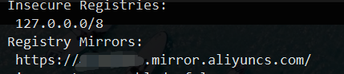
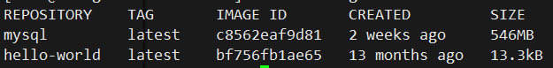
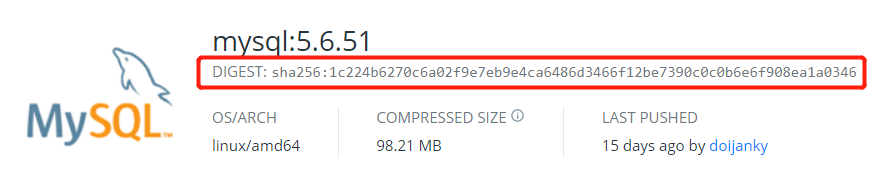
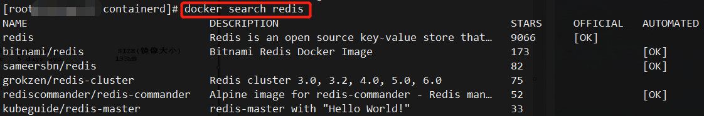
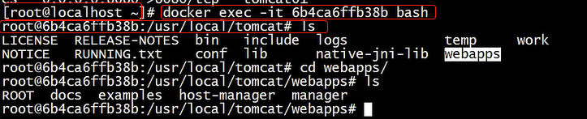
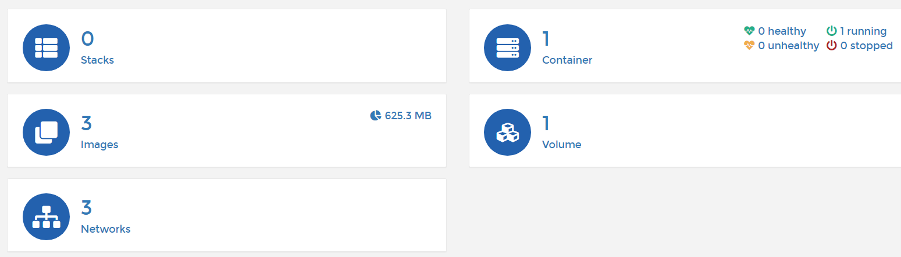

# MyDocker
Docker 基础。 


## 1.基本概念

+ ##### 什么是`Docker`?

  + 应用容器技术，操作系统层面的虚拟化技术
  + 通俗地可以这样理解（仅作为理解辅助，不用于技术解释）
    + 和`VM`之类的虚拟机技术做对比，`VM`是系统级别的虚拟技术，安装好的虚拟系统拷走镜像，在另一台机器上可以用`VM`打开，系统还是那个系统，一模一样。
    + 而`Docker` “虚拟”的大小比系统小，它只是“虚拟”应用和相关环境，打包成镜像（可以理解为刻了一张光盘），然后把镜像拷贝走，在另一台机器上（`Windows`、`Linux`、`MAC`）的`Docker`里，可以正常运行。应用的环境一模一样。省去重新安装环境的时间。

+ ##### 为什么是`Docker`?

  + ###### 一致的运行环境，更轻松的迁移

    + **应对场景**：开发的时候，在本机测试环境可以跑，生产环境跑不起来

  + ###### 对进程进行封装和隔离(**进程级别隔离**)，容器与容器之间互不影响，更高的利用系统资源

    + **应对场景**：服务器自己的程序挂了，结果发现是别人程序出了问题把内存吃完了，自己程序因内存不足就挂了

  + ###### 可以通过镜像复制`N`多个环境一致的容器

    + **应对场景**：公司举行线上活动，为应对大量的流量，需要多部署几十台服务器

+ ##### `Docker`和虚拟机的区别

  + |       比较项目       |                 `VM`                 |             `Docker`              |
    | :------------------: | :----------------------------------: | :-------------------------------: |
    |       系统携带       |                 `√`                  |                `/`                |
    | 资源（内存）调用流程 | 虚拟内存->虚拟物理内存->真正物理内存 |    虚拟物理内存->真正物理内存     |
    |       磁盘占用       |                 `GB`                 |               `MB`                |
    |       启动速度       |                 分钟                 |                秒                 |
    |       安装管理       |            专门的运维技术            |          安装、管理方便           |
    |       应用部署       |               费时费力               |     从第二次部署开始轻松简捷      |
    |       系统依赖       |                 `/`                  | 需求相同或相似的内核，推荐`Linux` |


## 2.安装和启动服务

+ ###### 安装

  + `Windows`需要开启`Hyper-V`
    + 控制面板 → 程序 → 卸载程序 →启动或关闭`Windows`功能→`Hyper-V`(勾选)
    + 下载`exe`，然后安装到自己喜欢的目录
  + `Linux`
    + `Bash`安装
      + ❗ **生产环境不建议用这种方法，因为所有配置参数都是默认的，而且下载的是最新的版本**
      + `curl -fsSL https://get.docker.com -o get-docker.sh`
      + `sudo sh get-docker.sh  --mirror Aliyun`
        + `--mirror Aliyun`，表示用阿里云镜像下载，加快速度
    + 其它安装方法官方教程：[传送门](https://docs.docker.com/engine/install/centos/)
  + 查看版本信息
    + `docker version`

+ ###### 运行服务

  + 启动服务
    + `systemctl start docker`
  + 设置开机启动
    + `systemctl enable docker`

+ ###### `docker`组设置

  + 新建`docker`组
    + `groupadd docker`
  + 将当前用户加入`docker`组
    + `usermod -aG docker $USER`
      + `-a`仅和`-G`一块使用，将用户添加到附属组群
      + `-G`，修改用户所属的附加群组
  + 重启`Docker`服务
    + `systemctl restart docker`

## 3. 核心概念

+ ###### 镜像（images）

  + `Docker`镜像，就相当于是一个`root` 文件系统。比如官方镜像 `ubuntu:16.04` 就包含了完整的一套 `Ubuntu16.04` 最小系统的 `root` 文件系统。
  + `Docker `镜像是用于创建 `Docker `容器的模板，比如 `Ubuntu` 系统。
  + **只读**

+ ###### 容器（`container`）

  + 容器是独立运行的一个或一组应用，是镜像运行时的实体。
  + 一个镜像可以被产生`n`个容器，就代表`n`个实例
  + **可读写**

+ ###### 仓库（`repository`）

  + 保存镜像的远程位置

## 4. 基本使用

+ ###### 从`DockerHub`中找镜像并下载（以`mysql`为例）

  + 在`DockerHub`中搜索`mysql`
  + 下载最新版镜像
    + `docker pull mysql`
  + 如果下载指定版镜像
    + `docker pull mysql:5.6.51`

+ ###### `docker`镜像加速

  + 登录阿里云→容器镜像服务→镜像中心→镜像加速器
  + 然后选择相应的系统，下边会有对应的代码，复制执行即可
  + 查看镜像是否设置成功
    + `docker info`查看信息中，有如下图，则为设置成功
    + 

  + 加速效果很明显

+ ###### 运行容器

  + `docker run hello-world`

    + `hello-world`，镜像名称

  + ###### 容器运行流程

    + 若本地没有发现`hello-world`镜像，则会从远程下载名为`hello-world`的镜像
    + 然后以镜像为模板生成一个容器

## 5.`Docker`相关操作

+ ##### `docker `引擎

  + ###### `CS`架构

    + `C`，`client`
    + `S`，`Server`
    + 可以用其它客户端操作`docker`服务

  + ###### `docker info`，显示`docker`信息

  + ###### `docker version`，主要用于查看`docker`版本信息

+ ##### 镜像相关命令

  + ###### `docker images`，查看本地镜像的相关信息

    + 
    + `CREATED`，镜像的创建时间，不是下载时间

  + `docker images -q`，只显示镜像`id`

    + 

  + 

  + ###### 拉取镜像方法

    + ###### 根据版本拉取

      + `docker pull mysql:5.6.51`

    + ###### 根据摘要拉取

      + `docker pull mysql:@DIGEST:sha256:1c224b6270c6a02f9e7eb9e4ca6486d3466f12be7390c0c0b6e6f908ea1a0346`
      + 

  + ##### 通过命令行搜索相关的镜像

    + `docker search resdis`
      + 和网页搜索是一样的效果
      + 

  + ##### 手动将本地镜像文件导入到docker仓库

    + 在镜像所在目录，`docker load -i mysql.tar`
      + `-i`，表示`image`

  + ##### 删除本地镜像

    + **注意**

      + 如果镜像正在使用中，正常删除会报错
      + 此时若还想删除，需要使用强制删除

    + ###### 两种方式

      + 根据镜像名[:版本号]，`docker image rm mysql`
      + 根据镜像`ID`删除，`docker image rm ae2feff98a0c`
      + `docker image rm`可简写为`docker rmi`

    + ###### 强制删除

      + 不仅会删掉镜像，还会删掉与之相关的容器
      + `docker image rm -f mysql`
      + 删除全部的镜像
        + `docker rmi -f $(docker images -aq)`
          + `docker images -aq`，列出所有镜像的`ID`
          + `$()`表示先执行括号里的，并将括号里的结果作为值给外边的命令使用

+ ##### 容器相关命令

  + ##### 运行容器

    + `docker run 镜像名:tag | 镜像id`
      + `docker run mysql:5.6.51`
      + `docker run 8391e8f6fea5`

  + ##### 查看当前运行的容器

    + `docker ps`
      + `-a`，所有容器，包括运行和非运行的容器
      + `-q`，返回正在运行的容器`id`

  + ##### 宿主机端口与容器中的端口进行映射

    + `-p`
    + `docker run -p host_port:docker_port mysql:5.6.51`

  + ##### 后台运行容器

    + `-d`

  + ##### 指定容器名字

    + `--name`
    + 名字唯一

  + ##### 停止|重启 容器

    + `stop`，正常停止
    + `kill`，立即停止
    + `restart`，重启

  + ##### 删除容器

    + ###### 删除已经停止运行的容器

      + `docker rm container_name|container_id`

    + ###### 删除正在运行的容器

      + `-f`

    + ###### 删除所有容器

      + `docker rm -f $(docker ps -aq)`

  + ##### 查看容器内运行的服务日志

    + `docker logs container_id|container_name`
      + `-f`，实时展示日志
      + `-t`，显示时间戳
      + `--tail n`，查看最后`n`行

  + ##### 查看容器内的进程

    + `docker top container_id|container_name`

  + ##### 与容器内部进行交互

    + `docker exec -it container_name|container_id CMMD`
      + `bash`，进入容器并与容器内的命令终端交互
      + 

    + `exit`，退出交互

  + ##### 传输文件

    + ###### 复制文件

      + ###### 容器到宿主机

        + `docker cp container_id|container_name:inner_file_path host_dir_path`

      + ###### 宿主机到容器

        + `docker cp host_file_path container_id|container_name:inner_dir_path`

  + 查看`docker`内部细节
    
    + `docker inspect`

## 6.数据卷（Volume）

+ **作用**：
  
  + 实现宿主机系统与容器之前的**文件共享**
  
+ ##### 在启动容器时候指定数据卷，两种方式

  + 目录路径必须是**绝对路径**

  + ###### 自定义数据卷目录

    + `-v` 宿主机目录`:`容器内的目录
    + 这种方式会清空容器内目录的文件
    + `docker run -d -p 8081:8080 --name mytest -v /data/share:/data/share/ tomcat:8.0-jre8`

  + ###### 自动数据卷目录

    + `docker run -d -p 8081:8080 --name mytest -v the_name_you_like:/data/share/ tomcat:8.0-jre8`
      + `the_name_you_like`，此时，容器启动后，会自动在宿主机上创建`the_name_you_like`目录
      + 适合那些需要把数据写在容器外边的服务，如，数据库等
  
+ ##### 数据卷特点

  + 数据卷可以在容器之间共享和重用
  + 对数据卷的修改，会立刻影响到对应的容器
  + 对数据卷的修改不会影响镜像
  + 数据卷默认会一直存在，即使容器被删除

+ ##### 读写控制

  + 宿主机可以影响容器，容器不能影响宿主机,`ro`
    + `docker run -d -p8990:8080 --name mysql_container -v /root/apps:/usr/local/mysql:ro mysql:5.6.51`

+ ##### 数据卷相关命令

  + ###### 查看数据卷

    + `docker volume ls`

  + ###### 查看数据卷细节

    + `docker volume inspect`

  + ###### 创建数据卷

    + `docker volume create volume_name`

  + ###### 删除数据卷

    + ###### 删除没有使用的数据卷

      + `docker volume prune`

    + ###### 删除指定的数据卷

      + `docker volume rm volume_name`

## 7.将容器打包成新的镜像

+ `docker commit -m"描述信息"-a"作者信息" 容器id|容器名称 打包成的镜像名称:标签名`
  + `docker commit -m"测试库MySQL" -a"maixiaochai" mysql mysql-test:1.0`


## 8.镜像备份

+ `docker save 镜像名称:Tag -o 文件名`
  + `docker save mysql-test:1.0 -o mysql-test-1.0.tar`

## 9.镜像的原理

+ `docker`的镜像实际是由一层一层的文件系统组成
  + `bootfs`
  + `rootfs`
+ `UnionFS`，联合文件系统
  + 最大的好处是资源共享


## 10.网络配置

+ `docker`允许通过外部访问容器或容器互联的方式来提供网络服务

+ `docker`容器与操作系统通信机制

  + `docker`启动时会自动在主机上创建一个虚拟网桥(`bridge`)
  + 创建一个新容器的时候会创建一对`veth port`接口，一端在容器内，另一端在本地被挂载到网桥
    + 当数据包发送到一个接口时，另外一个接口也可以收到相同的数据包

+ ##### `docker`网络使用

  + 一般在使用`docker`网桥时不使用默认的公共网桥，容易影响其它容器的网络使用，而是站在同一个应用的角度设置网桥

  + ###### 一些命令

    + ###### 查看`docker`网桥配置

      + `docker network ls`

    + ###### 创建网桥

      + `docker network create mysql_bridge`
        + 等价于 `docker network create --driver bridge mysql_bridge`
          + `--driver`, 网络类型

    + ###### 使用网桥

      + `docker run -d -p 8081:8080 --name mysql01 --network mysql_bridge mysql:5.6.51`
        + 注意，此时，容器的名字`mysql01`和容器的`ip`**自动**进行了映射，在同一网桥下访问容器的名字即可访问到容器

    + ###### 删除网桥

      + `docker network rm the_bridge_name`

    + ###### 查看具体网桥信息

      + `docker inspect the_bridge_name`

## 11. `Docker`启动特定容器服务

+ ##### 操作步骤，以`MySQL`为例

  + 在`DockerHub`上搜索，然后`pull`
  + 查看描述信息，了解使用方法
  + `docker run --name mysql -e MYSQL_ROOT_PASSWORD=maixiaochai -d -p 3306:3306  -v mysqldata:/var/lib/mysql -v mysqlconfig:/etc/mysql mysql:tag`
    + --name，容器名称
    + -e，后边接要给容器配置的环境变量
      + `MYSQL_ROOT_PASSWORD=maixiaochai`，设置MySQL的root密码为maixiaochai
    + -d，表示可后台运行
    + -p，端口映射（宿主机端口号：容器端口号）
    + -v，映射数据卷，将数据文件保存在宿主机
      + /var/lib/mysql，MYSQL镜像中默认数据保存目录
      + -v mysqlconfig:/etc/mysql，将MySQL配置文件保存的目录映射出去，使得MYSQL**重启**的时候能加载自定义配置

+ ##### 安装redis

  + `docker run -d -p 6379:6379 --name redis -v redisdata:/data -v myredis/conf/:/usr/local/etc/redis/ redis:5.0.10 redis-server --appendonly yes /usr/local/etc/redis/redis.conf`
    + `redis-server --appendonly yes`，开启持久化
    + `-v redisdata:/data`，将持久化目录映射到宿主机
    + `/usr/local/etc/redis/redis.conf`，使用`redis.conf`这里边的配置
      + 配置文件从redis源码中找一个改一改，然后放到被映射的宿主机配置目录

## 12.`Dockerfile`

+ ##### 简述

  + Dockerfile，是一个用来构建镜像的文本文件，文本内容包含了一条条构建镜像所需的指令和说明
  + 用于构建自己的应用的镜像
  + 
  
+ ##### 构建镜像

  + ###### 构建过程

    + 创建一个目录（构建上下文目录），目录中创建`Dockerfile`文件，名字推荐用`Dockerfile`
    + 在执行`build`命令之后，会将内容打包发送到server端，进行层层镜像创建
    + 中间创建的镜像会保存到缓存中，方便修改后快速构建

  + ###### 相关命令

    + `FROM`，当前镜像基于哪个镜像
    + `RUN`，构建镜像时需要运行的命令
    + `EXPOSE`，当前容器对外暴露出的端口
    + `WORKDIR`，指定在创建容器后，终端默认登录进来的工作目录，一个落脚点
      + 如果`WORKDIR`不存在，即使它在没有任何后续`Dockerfile`指令中使用，他也将被创建
      + `WORKDIR`可以在`Docker`中多次使用，如果提供了相对路径，则该路径将与先前`WORKDIR`指令的路径相对
    + `ENV`，用来在构建过程中设置环境变量
      + 以后可以复用
      + 在运行容器的时候可以设置环境变量
    + `ADD`，将宿主机目录下的文件拷贝进镜像且`ADD`命令会自动处理URL和解压tar包（**下载的压缩包不能解压**）
    + `COPY`，类似于`ADD`，拷贝文件和目录到镜像中，将从构建上下文目录中<原路径>的文件或目录复制到新的一层的镜像内的<目标路径>位置
    + `VOLUME`，容器数据卷，用于数据保存和持久化工作，`-v`的容器端
  + `CMD`，指定一个容器启动时要运行的命令，`Dockerfile`中可以有多个`CMD`命令，但只有**最后一个生效**，`CMD`会被`docker run` 之后的参数替换
    
  + `ENTRYPOINT`，指定一个容器启动时要运行的命令，`ENTRYPOINT`的目的和`CMD`一样，都是在指定容器启动程序及其参数
    
  + ###### 使用案例
  
    + `mkdir mydocker && cd mydocker`
  
    + `vim Dockerfile`
  
      + ```shell
        FROM centos:7
        RUN yum install -y vim
        EXPOSE 8080
        EXPOSE 15672
        WORKDIR /data
        ENV CORE_DATA_DIR /data/coredata
        COPY a.txt /data/files
        ADD https://mirrors.bfsu.edu.cn/apache/tomcat/tomcat-10/v10.0.2/bin/apache-tomcat-10.0.2.tar.gz /data/packages
        ADD pandas‑1.2.2‑cp39‑cp39‑win_amd64.whl /data/pylibs
        ADD apache-tomcat-10.0.2.tar.gz /data/softwares
        RUN cd /data/softwares && mv apache-tomcat-10.0.2 tomcat
        VOLUMN $CORE_DATA_DIR
        ENTRYPOINT ["ls"]
        CMD ["/data/coredata"]
        ```
  
    + `docker build -t mycentos7:01 .`
  
      + -t，指定仓库名称和版本（镜像名称和版本）
      + `.`，当前目录，`Dockerfile`所在目录
  
    + `COPY a.txt /data/files`，拷贝当前目录下的a.txt到 镜像的/data/files目录下
  
    + ```shell
      ADD apache-tomcat-10.0.2.tar.gz /data/softwares
      RUN cd /data/softwares && mv apache-tomcat-10.0.2 tomcat
      ```
  
      + 在解压之后，重命名
  
    + ```shell
      ENTRYPOINT ["ls"]
      CMD ["/data/coredata"]
      ```
  
      + 在`docker run mycentos7:2`时，会默认打印`/data/coredata`下的对象
      + 同时，CMD后面的内容可由run后边的参数覆盖，如
        + `docker run mycentos7:2 /data/packages`，`/data/packages`会覆盖CMD后边的内容，执行的时候会打印`/data/packages`下的对象

## 13.`Docker Compose`

+ ##### 简述

  + `Compose` 项目是`Docker`官方的开源项目，负责实现对`Docker`集群的快速编排
    
    + 通过一个单独的`docker-compose.yml`
    
  + 定位，定义和运行多个`docker`容器的应用，同时可以对多个容器进行编排

    

+ ##### `Compose`两个重要概念

  + 服务（`service`）：一个容器，实际上可以包括若干运行相同镜像的容器实例

  + 项目（`project`）：由一组关联的应用容器组成的一个完整业务单元，在`docker-compose.yml`文件中定义

    

+ ##### `Docker-compose`安装(`LINUX`)

  + ```shell
    sudo curl -L "https://github.com/docker/compose/releases/download/1.28.4/docker-compose-$(uname -s)-$(uname -m)" -o /usr/local/bin/docker-compose
    ```

  + ```shell
    sudo chmod +x /usr/local/bin/docker-compose
    ```

  + ```shell
    sudo ln -s /usr/local/bin/docker-compose /usr/bin/docker-compose
    ```

  + ###### 检测是否安装成功

    + `docker-compose -v`

      + 成功后显示：`docker-compose version 1.28.4, build cabd5cfb`

        

+ ##### `Docker_compose`使用

  + 创建`docker-compose.yml`文件

  + 配置文件

    + ```shell
      version:"3.8" # 指定项目版本（目前最高版本3.8）
      
      services:
      	web_build_test:
      		build:
      			context: demo # 指定上下文目录(要打包的Dockerfile所在的目录, 相对目录和绝对目录都行)
      			dockfile: Dockerfile
      		container_name: c_demo
      		
      		ports:
      			- "8083:8083"
      
              networks:
              	- hello
      
              depends_on:
              	- tomcat01
      		
      	tomcat01:	# 服务名唯一
      		container_name: tomcat01
      		image: tomcat:9.0-jre9 # 创建当前这个服务使用的镜像
      		ports:
      			- 8080:8080 # 宿主机端口:容器端口，最好用引号包起来，<60的端口，在yml中会解析成60进制
              volumes:
              	# - /root/apps:/usr/local/tomcat/apps
              	- tomcatdata01:/usr/local/tomcat/apps
              
               networks: # 代表当前服务使用哪个网络
               	- hello
          	
          	depends_on:
          		- redis
          		- mysql
          
       	tomcat02:
       		container_name: tomcat02
           	image: tomcat:9.0-jre9 # 创建当前这个服务使用的镜像
           	ports:
      			- 8081:8080 # 宿主机端口:容器端口，最好用引号包起来，<60的端口，在yml中会解析成60进制
              volumes:
              	# - /root/apps:/usr/local/tomcat/apps
              	- tomcatdata02:/usr/local/tomcat/apps
              	
      		networks: # 代表当前服务使用哪个网络
      			- hello
      		
           mysql:
           	image: mysql:8.0.23
           	container_name: mysql
           	
           	port:
           		- "3306:3306"
           		
           	volumes:
           		- mysqldata:/var/lib/mysql
           		- mysqlconfig:/etc/mysql
           		
              # environment:
              	# - MYSQL_ROOT_PASSWORD=root
            
             	env_file:
             		- mysql.env
              
              networks:
              	- hello
              
              healthcheck:
              	test: ["CMD", "curl", "-f", "http://localhost"]
              	interval: 1m30s
              	timeout: 10s
              	retries: 3
           
           redis:
           	image: redis:6.2.0
           	container_name: redis
           	
           	ports:
           		- "6379:6379"
           		
              volume:
              	- redisdata:/data
              	
             	networks:
             		- hello
             		
              command: "redis-server --appendonly yes" # run镜像之后，覆盖容器内部命令
           
       volumes: # 声明上面服务所使用的的自动创建的卷名
       	tomcatdata01: # 声明指定的卷名
       				  # compose自动创建该卷名但是会在之前加入项目名称，如 hello_tomcatdata
          	external: # 使用自定义卷名
          		false # 确定是否使用自定义卷名，如果为true，则需要在服务启动前先手动创建该卷
         	
         	mysqldata:
         	mysqlconf:
       	redisdata:
       	
       networks:
       	hello: # 定义上面服务用到的网桥名称，默认创建就是 bridge
       		external:
       			true	# 使用外部指定的网桥，网桥必须在服务启动前手动创建
       
      ```
      
    + `mysql.env`

      ```shell
      MYSQL_ROOT_PASSWORD=root
      ```

      

  + ###### 启动项目

    + `docker-compose up`（默认前台启动）

      + 必须保证运行命令所在的目录中存在`docker-compose.yml`文件

        

+ ##### `docker-compose`模板指令

  + `version`，`compose`版本，

    + 最高支持的版本可以在这里查到：[传送门](https://docs.docker.com/compose/compose-file/compose-file-v3/)

  + `volumes`，数据卷，等价于 `run -v`

  + `networks`，网络，等价于 `run --network`

  + `container_name`，给容器指定名字，等价于 `run --name`

  + `command`，`docker run` 启动容器时，运行的一些命令，用来覆盖程序默认启动指令

  + `environment`，用于指定容器启动时的环境参数

  + `env_file`，环境变量保存的文件路径，用于从文件中获取环境变量

    + 要求文件必须以`.env`结尾

      

  + `depends_on`，解决容器的依赖、启动顺序问题

    + 表示这个服务启动需要依赖于哪些其它服务
    + 后边写**服务**`ID`而不是**容器名称**
    + 该服务不会等到所依赖的服务完全启动后才启动，而是等到所依赖的服务启动到一定程度就启动

  + `healthcheck`，用于告诉`Docker`引擎应该如何进行判断容器的状态是否正常

  + `sysctls`，修改容器中系统内部参数

    + 非必须，有些服务启动受到容器内操作系统参数限制可能会无法启动，必须通过修改容器中参数才能启动

  + `ulimits`，用来修改容器内部系统的最大进程数，使用时可根据当前容器运行服务要求进行修改

    

  + `build`，用来将指定的`Dockerfile`打包成镜像，然后再运行该镜像

    

+ ##### `compose` 模板指令和`compose` 指令区别(**本文件中所提及的“指令”和“命令”指的均为同一个东西** )

  + **模板指令**，用于书写在`docker-compose.yml`文件中的指令
  
  + **指令**，用于对整个`docker-compose.yml`对应的这个项目操作，写在`docker-compose`命令之后的命令
  
    
  
+ ##### `compose `命令选项

  + `-f， --file`，指定使用的`compose`模板文件，默认为`docker-compose.yml`，可以多次指定

  +  `-p,--project-name`，指定项目名称，默认将使用所在目录名称作为项目名称

  + `--x-networking`，使用`Docker`的可插拔网络后端特性

  + `--verbose`，输出更多调试信息

  + `-v,--version`，打印版本并退出

    

+ `Docker-compose`命令

  + `up`

    + 它将尝试自动完成包括构建镜像，（重新）创建服务，并关联服务相关容器的一系列操作
    + 关联的服务都将会自动启动，除非已处于运行状态
    + `docker-compose up`启动的容器在前台运行，控制台将打印所有容器的输出信息
    + `Ctrl+C`停止命令时，所有容器将会停止
    + 如果使用`docker-compose up -d`，将会在后台启动并运行所有的容器
    + 默认下，如果容器已经存在，将会尝试停止容器，然后重新创建（保持使用`volume-from`挂载的卷），以保证新服务以`docker-compose.yml`文件的最新内容启动

  + `down`

    + 关闭所有`docker-compose.yml`中的服务，并移除网络（会移除自动创建的网络，不会移除外部网络）
    + 不会移除数据卷

  + `exec`

    + 进入指定的容器

    + 类似`docker exec`但有些不同

      + 例如，`docker`进入`23fdd00a692b`容器内并使用`shell`，`docker exec -it 23fdd00a692b bash`

      + `docker-compose`要用服务`ID`（也就是服务名）进入，`docker-compose exec redis bash`

        

  + `ps`

    + 展示当前`docker-compose`运行的所有容器

  + `restart`

    + 重启项目中的服务

  + `rm`

    + 删除所有（停止状态的）服务容器。推荐先执行`docker-compose stop`命令来停止容器
    + `-f`，前置直接删除，包括非停止状态的容器服务
    + `-v`，删除容器所挂载的数据卷，**谨慎使用**

  + `start`
    + 启动已经存在的容器服务
  + `stop`
    + 停止已处于运行状态的容器但不删除它
    + `-t`，停止容器时的超时时间
  + `top`
    + 查看各个服务容器内运行的进程
  + `unpause`
    + 恢复处于暂停状态的服务
  + `logs`
    + 查看服务日志，默认查看所有服务日志
    + `docker-compose logs redis`

## 14.`Portainer`-`Docker`可视化工具

+ ##### 安装

  + `docker pull portainer/portainer`

+ ##### 启动

  + ```shell
    docker run -d \
    -p 8000:8000 \
    -p 9000:9000 \
    --name=portainerWeb \
    --restart=always \
    -v /var/run/docker.sock:/var/run/docker.sock \
    -v portainer_data:/data portainer/portainer
    ```

  + `--restart=always`，只要容器关闭则立即重启

+ ##### 访问

  + `http://你的机器的ip:9000`
    + 如果是远程主机，需要开放`9000`端口
  + 然后设置管理员用户和密码
  + 选择`Local`选项进行连接即可

+ ##### 一些说明

  + 
    + `stack`，栈，一个`stack`就带表一个`docker-compose`在运行

## 相关链接

+ [DockerHub](https://registry.hub.docker.com/)
+ [《Docker—从入门到实践》](https://vuepress.mirror.docker-practice.com)
+ **from**[《【编程不良人】2021年最新Docker容器技术&Docker-Compose实战教程》](https://www.bilibili.com/video/BV1ZT4y1K75K)
