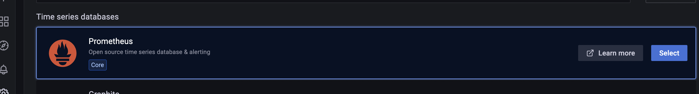
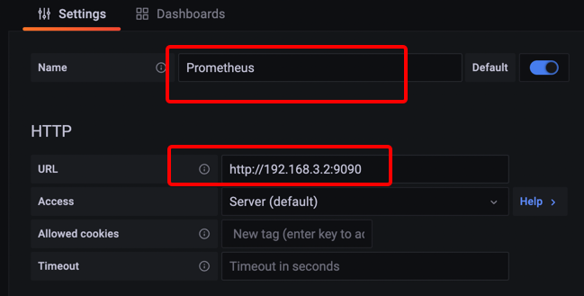
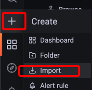
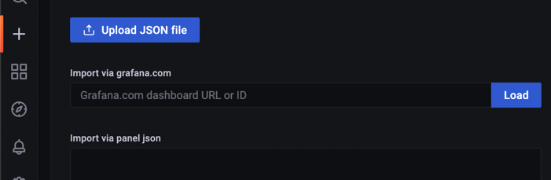
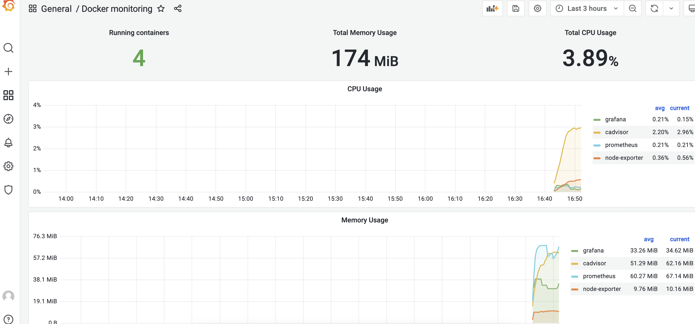

### 用`prometheus`监控`Docker`和服务器

1. **安装`prometheus`**

   + `Prometheus` 是一套开源的监控 + 预警 + 时间序列数据库的组合

   1. `docker pull prom/prometheus`

   + `docker run -d --name=prometheus --restart=always -p 9090:9090 prom/prometheus`
   + 访问`ip:9090`，查看页面

2. **安装`grafana`**

   + 一个跨平台的开源的度量分析和可视化工具，可以通过将采集的数据库查询后可视化的展示，并及时通知

   + `docker pull grafana/grafana`

   + `mkdir /data/dockerData/grafanaData`

   + ```shell
     docker run -d --name=grafana \
     	--restart=always \
     	-p 3000:3000 \
     	-v /data/dockerData/grafanaData:/var/lib/grafana \
     	grafana/grafana
     ```

   + 访问`ip:3000`验证是否安装成功，默认账号和密码`admin\admin`

3. **安装`node_exporter`**

   + `node_exporter` 是 `Prometheus` 的一个 `export`，主要是用来收集服务器硬件资源使用情况

   + `docker pull prom/node-exporter`

   + ```shell
     docker run -d --name=node-exporter \
     	--restart=always \
     	-p 9100:9100  \
     	-v "/proc:/host/proc:ro" \
     	-v "/sys:/host/sys:ro" \
     	-v "/:/rootfs:ro" \
     	prom/node-exporter
     ```

   + 访问`ip:9100/metrics`， 查看监控收集的数据

     + 

4. **配置`prometheus`和`node_exporter`**

   + `prometheus`本身没有收集功能，需要后连接后者进行数据收集，需要修改`prometheus`的配置文件

     + 从`Prometheus`容器中拷贝配置文件到宿主机

       + `docker cp prometheus:/etc/prometheus/prometheus.yml ./`

       + 添加如下内容：

         + ```shell
             - job_name: "nuc"
               static_configs:
                 - targets: ['localhost:9100']
           ```

     + 将配置文件复制回容器中，

       + `docker cp ./prometheus.yml prometheus:/etc/prometheus/prometheus.yml`

5. **综合配置**

   + 登陆`Grafana`并修改密码

   + 在首页中，点击“Add your first source”，然后时间序列数据库选择`Prometheus`

     + 

   + 然后在`Name`处写一个喜欢的名字，在URL处填上`Prometheus`的对外服务地址，端口`9090`

     + 
     + 然后点击`Save & test`，如果出现了绿色背景的提示，说明成功了。

   + 点击`Back`，然后点击“+”，然后点击`import`

     + 

   + 然后输入`12884`，点击`load`，然后在底部选择之前创建的`prometheus`数据源即可。

     + 

       

6. **使用`docker-compose`配置整套服务**

   + 安装`docker-compose`

     + ```shell
       sudo curl -L https://get.daocloud.io/docker/compose/releases/download/v2.2.2/docker-compose-`uname -s`-`uname -m` -o /usr/local/bin/docker-compose
       ```

     + 授权

     + ```shell
       sudo chmod +x /usr/local/bin/docker-compose
       ```

     + 检验是否安装成功

     + ```shell
       docker-compose -v
       ```

   + 做一些小准备

     + 新建网桥，相关的服务走同一个网桥，减少公共网桥压力，同时也提高整体服务性能

       + `docker network create prometheus_bridge`

     + `prometheus.yml`中额外添加对容器监控的服务—`cadvisor`

       + ```shell
           - job_name: "prometheus"
           
             # metrics_path defaults to '/metrics'
             # scheme defaults to 'http'.
           
             static_configs:
               - targets: ["localhost:9090","192.168.3.2:9100","192.168.3.2:8080"]
         ```

       + 

   + 编写`docker-compose-prometheus.yml`配置文件

     + ```shell
       version: '3.8'
        
       networks:
           bridge_prometheus:
               driver: bridge
        
       services:
           prometheus:
               image: prom/prometheus
               container_name: prometheus
               hostname: prometheus
               restart: always
               volumes:
                   - /data/dockerConfig/prometheus/prometheus.yml:/etc/prometheus/prometheus.yml
               ports:
                   - "9090:9090"
               networks:
                   - bridge_prometheus
               depends_on:
                   - node-exporter
                   - cadvisor
       
           grafana:
               image: grafana/grafana
               container_name: grafana
               hostname: grafana
               restart: always
               volumes:
                       - /data/dockerData/grafanaData:/var/lib/grafana
               ports:
                   - "3000:3000"
               networks:
                   - bridge_prometheus
               depends_on:
                   - prometheus
       
           node-exporter:
               image: prom/node-exporter
               container_name: node-exporter
               hostname: node-exporter
               restart: always
               volumes:
                   - /proc:/host/proc:ro
                   - /sys:/host/sys:ro
                   - /:/rootfs:ro
               ports:
                   - "9100:9100"
               networks:
                   - bridge_prometheus
        
           cadvisor:
               image: google/cadvisor:latest
               container_name: cadvisor
               hostname: cadvisor
               restart: always
               volumes:
                   - /:/rootfs:ro
                   - /var/run:/var/run:rw
                   - /sys:/sys:ro
                   - /var/lib/docker/:/var/lib/docker:ro
               ports:
                   - "8080:8080"
               networks:
                   - bridge_prometheus
       
       ```

   + 启动服务

     + `docker-compose -f /data/dockerConfig/prometheus/docker-compose-prometheus.yml up -d`

   + 停止服务

     + `docker-compose -f /data/dockerConfig/prometheus/docker-compose-prometheus.yml down`

   + 查看服务状态

     + `docker-compose -f /data/dockerConfig/prometheus/docker-compose-prometheus.yml ps`

   + `Grafana`配置和前边 `node-exporter`大同小异，使用 `193`模板

     + 

------

The end.

